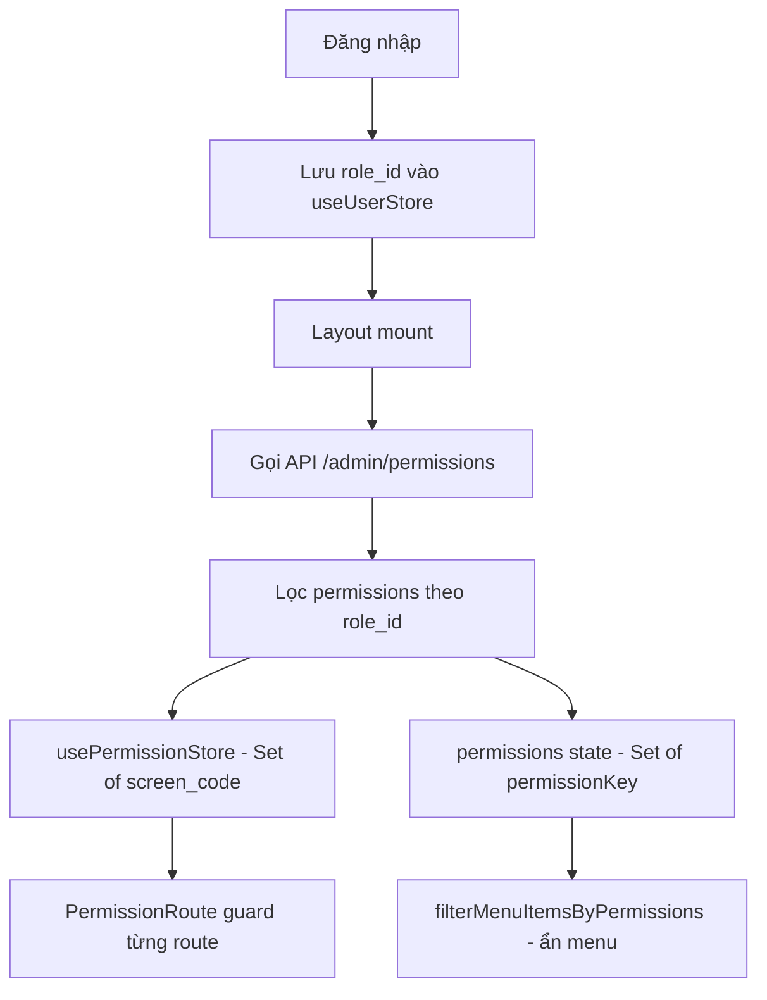
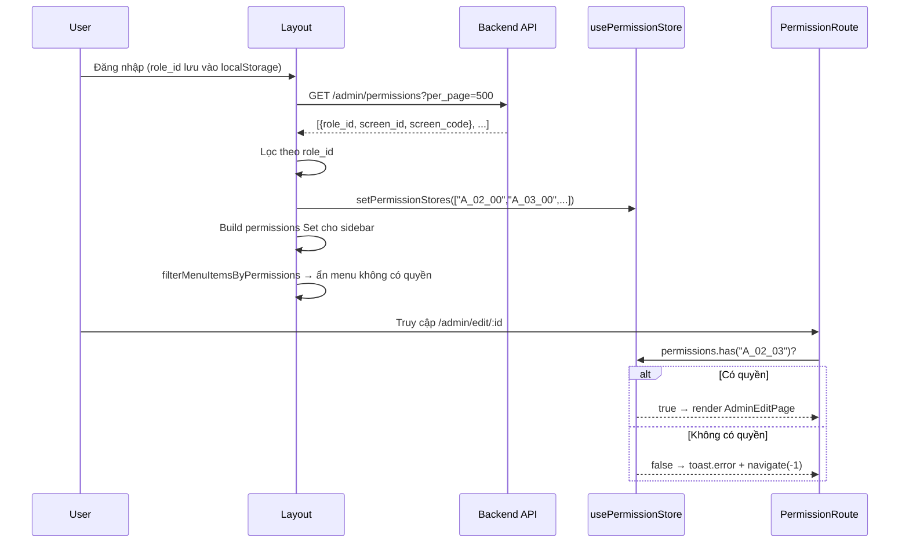

# Phân tích cơ chế phân quyền màn hình — `go-edu-fe`

## Tổng quan kiến trúc

Hệ thống phân quyền màn hình hoạt động theo mô hình **RBAC (Role-Based Access Control)** với 3 tầng chính:



---

## Các thành phần chính

### 1. Dữ liệu gốc — Backend

| Entity | API Endpoint | Mô tả |
|---|---|---|
| `Screen` | `GET /admin/screens` | Danh sách màn hình (id, name, **code**) |
| `Role` | `GET /admin/roles` | Danh sách vai trò (id, name) |
| `Permission` | `GET /admin/permissions` | Liên kết role ↔ screen (role_id, screen_id, **screen_code**) |
| Cập nhật quyền | `PUT /admin/permissions/update` | Toggle quyền theo `{ role_id, screen_id, has_access }` |

### 2. Mã hóa quyền (Permission Code)

Mỗi route được gán một **`screen_code`** theo cấu trúc `A_{module}_{action}`:

```
A_01_00  → Dashboard
A_02_00  → Quản lý admin
A_02_01  → Chi tiết admin
A_02_02  → Thêm admin
A_02_03  → Sửa admin
A_02_10  → Quản lý giáo viên  (10 = teacher)
A_02_20  → Quản lý học sinh   (20 = student)
A_02_30  → Quản lý vai trò    (30 = roles)
A_02_40  → Phân quyền màn hình (40 = permissions)
A_02_50  → Quản lý phụ huynh  (50 = parent)
A_03_XX  → Khóa học
A_04_XX  → Lớp học
A_05_XX  → Bài học
A_06_00  → Môn học
A_07_00  → Cấp độ
A_08_XX  → Tin tức
A_09_00  → Đăng ký
A_10_XX  → Câu hỏi
```

**Quy tắc action:** `00=list`, `01=detail`, `02=add`, `03=edit`, `04=flow/other`

---

## Luồng hoạt động chi tiết

### Bước 1 — Đăng nhập (`useUserStore`)

```ts
// store/useUserStore.ts
interface UserStore {
  userEmail: string;
  role_id: number | null;    // ← khóa chính để lọc permission
  isAuthenticated: boolean;
}
```
Sau khi login thành công, `role_id` được persist vào `localStorage` (key: `"user"`).

---

### Bước 2 — Layout khởi tạo (`components/layout/index.tsx`)

Khi Layout mount, nó fetch **toàn bộ** permission table rồi **lọc theo `role_id`** của user hiện tại:

```ts
const permissionsRes = await PermissionApi.getPermissions({ page: 1, per_page: 500 });

// ① Lưu vào PermissionStore (dùng cho route guard)
usePermissionStore.getState().setPermissionStores(
  permissionsRes.data?.items
    .filter(item => item.role_id === role_id)
    .map(item => item.screen_code)   // ["A_02_00", "A_03_00", ...]
);

// ② Build permission set cho sidebar menu
const permissionCodes = permissionsRes.data?.items
  ?.filter(item => item.role_id === role_id)
  .map(item => codeToPermissionKey[item.screen_code])  // ["admin:view", "course:view", ...]
  .filter(Boolean);
setPermissions(new Set(permissionCodes));
```

**Mapping `screen_code` → `permissionKey`** (trong `Permission.dataHelper.ts`):

```ts
export const codeToPermissionKey: Record<string, string> = {
  "A_01_00": "dashboard:view",
  "A_02_00": "admin:view",
  "A_02_10": "teacher:view",
  "A_02_20": "student:view",
  "A_02_30": "userRole:view",
  "A_02_40": "permissions:view",
  "A_02_50": "parent:view",
  "A_03_00": "course:view",
  "A_08_00": "news:view",
  ...
};
```

> [!NOTE]
> Mapping này chỉ bao gồm màn hình **list** (`_00`). Các màn hình con (detail/add/edit) được kiểm soát trực tiếp bằng `screen_code` trong route guard, **không** qua `permissionKey`.

---

### Bước 3 — Ẩn menu sidebar

```ts
// layout/index.tsx
const filterMenuItemsByPermissions = (menuItems, permissions) =>
  menuItems
    .filter(item => !item.permissionKey || permissions.has(item.permissionKey))
    .map(item => ({ ...item, children: item.children
      ? filterMenuItemsByPermissions(item.children, permissions) : undefined }))
    .filter(item => !item.children || item.children.length > 0);
```

- Menu item **không có** `permissionKey` → luôn hiển thị (Dashboard, Profile...)
- Menu item **có** `permissionKey` → chỉ hiển thị nếu có trong `permissions` Set
- Menu group (`children`) tự ẩn nếu không còn item con nào

---

### Bước 4 — Bảo vệ route (`PermissionRoute.tsx`)

```ts
// components/PermissionRoute.tsx
const canAccess = permissions.has(requiredCode);  // permissions là Set<screen_code>

useEffect(() => {
  if (!canAccess) {
    toast.error(t("screenPermissions.error_permission"));
    navigate(-1);  // ← quay về trang trước
  }
}, [canAccess]);

if (!canAccess) return null;
return <>{children}</>;
```

Mỗi route được wrap:

```tsx
// Router.tsx
{protectedRoutes.map(({ path, element, permission }) => (
  <Route
    key={path}
    path={path}
    element={<PermissionRoute requiredCode={permission}>{element}</PermissionRoute>}
  />
))}
```

---

### Bước 5 — Trang quản lý phân quyền (`PermissionManage/`)

#### Màn hình quản lý: Ma trận `Screen × Role`

```
           | Role A | Role B | Super Admin |
-----------+--------+--------+-------------|
Dashboard  |   ✓    |   ✓    |      ✓      |
Khóa học   |   ✓    |        |      ✓      |
Giáo viên  |        |   ✓    |      ✓      |
```

#### Các ràng buộc bất biến:

| Điều kiện | Xử lý |
|---|---|
| `screen.code` thuộc `specialScreenCodes` | Ô checkbox bị disabled (không thể bỏ quyền admin list) |
| `role.name === "Super Admin"` | Toàn bộ hàng bị disabled |
| `screen.code` thuộc `hiddenScreenCodes` | Dòng bị ẩn hoàn toàn khỏi bảng |

```ts
// Permission.dataHelper.ts
export const specialScreenCodes = ["A_02_00","A_02_01","A_02_02","A_02_03"];
export const hiddenScreenCodes = ["A_00_02", "A_00_01", "A_00_00"];
```

#### Luồng toggle + lưu:

```
User click checkbox
    → handleToggle(screenId, roleId)
        → cập nhật permissions state (optimistic UI)
        → thêm vào paramToUpdate[]
User click Save
    → PUT /admin/permissions/update { permissions: [...] }
    → refetch permissions
    → cập nhật cả usePermissionStore lẫn usePermissionCacheStore
```

---

## Cache Layer

```ts
// store/usePermissionCacheStore.ts
export const CACHE_DURATION = 5 * 60 * 1000; // 5 phút

// Persist vào localStorage, key: "permission-data-cache"
// Lưu: screens[], roles[], permissions[], lastFetched
```

Cache được dùng trong `PermissionPage` để tránh re-fetch khi vào lại trang quản lý phân quyền trong vòng 5 phút. **Lưu ý:** Layout không dùng cache này — mỗi lần mount đều fetch mới.

---

## Hai Store song song

| Store | Key (localStorage) | Nội dung | Dùng cho |
|---|---|---|---|
| `usePermissionStore` | *(in-memory, không persist)* | `Set<screen_code>` của role hiện tại | Route guard |
| `usePermissionCacheStore` | `"permission-data-cache"` | Full `screens[]`, `roles[]`, `permissions[]` | Trang quản lý phân quyền |
| `useUserStore` | `"user"` | `role_id`, `email`, `isAuthenticated` | Xác thực & lọc permission |

---

## Sơ đồ luồng đầy đủ



---

## Điểm cần lưu ý / Cải tiến tiềm năng

> [!WARNING]
> **Layout fetch không dùng cache:** Mỗi lần mount `Layout` đều gọi `GET /admin/permissions`, ngay cả khi `usePermissionCacheStore` đã có dữ liệu mới. Có thể tối ưu bằng cách tái dùng cache này.

> [!WARNING]
> **`usePermissionStore` không persist:** Khi F5 trình duyệt, store bị reset về `Set()` rỗng, dẫn đến tất cả `PermissionRoute` trả về `null` cho đến khi `Layout` fetch xong. Hiện tại được xử lý bằng `isLoading` state trong Layout.

> [!TIP]
> **Điểm mở rộng:** Để thêm module mới cần phân quyền, chỉ cần:
> 1. Thêm entry vào `protectedRoutes` trong `Router.tsx` với `permission: "A_XX_YY"`
> 2. Thêm mapping vào `codeToPermissionKey` nếu cần hiển thị trên sidebar
> 3. Thêm menu item với `permissionKey` tương ứng vào `Layout`
